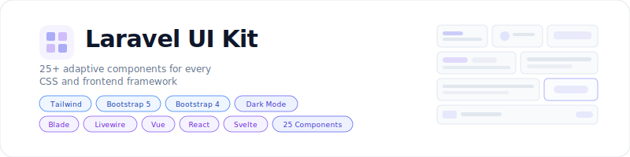

<p align="center">
    <picture>
        <source media="(prefers-color-scheme: dark)" srcset="art/banner-dark.svg">
        <source media="(prefers-color-scheme: light)" srcset="art/banner-light.svg">
        
    </picture>
</p>

<p align="center">
25+ adaptive UI components that render natively in Tailwind, Bootstrap 5,<br>and Bootstrap 4 with Blade, Livewire, Vue, React, and Svelte support.
</p>

<p align="center">
    <a href="https://packagist.org/packages/jeremykenedy/laravel-ui-kit"></a>
    <a href="https://packagist.org/packages/jeremykenedy/laravel-ui-kit"></a>
    <a href="https://opensource.org/licenses/MIT"></a>
</p>

## Table of Contents

- [Framework Support](#framework-support)
- [Components](#components)
- [Installation](#installation)
- [Configuration](#configuration)
- [Usage](#usage)
- [Artisan Commands](#artisan-commands)
- [Testing](#testing)
- [License](#license)

## Framework Support

Every component renders identically across all CSS and frontend combinations:

|  | Blade + Alpine.js | Livewire 3 | Vue 3 | React 18 | Svelte 4 |
|---|:---:|:---:|:---:|:---:|:---:|
| **Tailwind v4** | :white_check_mark: | :white_check_mark: | :white_check_mark: | :white_check_mark: | :white_check_mark: |
| **Bootstrap 5** | :white_check_mark: | :white_check_mark: | :white_check_mark: | :white_check_mark: | :white_check_mark: |
| **Bootstrap 4** | :white_check_mark: | :white_check_mark: | :white_check_mark: | :white_check_mark: | :white_check_mark: |

## Components

| Component | Blade | Livewire | Vue | React | Svelte |
|---|:---:|:---:|:---:|:---:|:---:|
| Alert | `<x-ui::alert>` | `<livewire:ui-alert>` | `<UiAlert>` | `<UiAlert>` | `<UiAlert>` |
| Avatar | `<x-ui::avatar>` | `<livewire:ui-avatar>` | - | - | - |
| Badge | `<x-ui::badge>` | `<livewire:ui-badge>` | `<UiBadge>` | `<UiBadge>` | `<UiBadge>` |
| Breadcrumbs | `<x-ui::breadcrumbs>` | - | - | - | - |
| Button | `<x-ui::button>` | `<livewire:ui-button>` | `<UiButton>` | `<UiButton>` | `<UiButton>` |
| Card | `<x-ui::card>` | `<livewire:ui-card>` | `<UiCard>` | `<UiCard>` | `<UiCard>` |
| Checkbox | `<x-ui::checkbox>` | `<livewire:ui-checkbox>` | - | - | - |
| Confirm | `<x-ui::confirm>` | `<livewire:ui-confirm>` | - | - | - |
| Data Table | `<x-ui::data-table>` | `<livewire:ui-data-table>` | - | - | - |
| Dropdown | `<x-ui::dropdown>` | `<livewire:ui-dropdown>` | - | - | - |
| Form Group | `<x-ui::form-group>` | `<livewire:ui-form-group>` | - | - | - |
| Icon | `<x-ui::icon>` | `<livewire:ui-icon>` | - | - | - |
| Input | `<x-ui::input>` | `<livewire:ui-input>` | `<UiInput>` | `<UiInput>` | `<UiInput>` |
| Modal | `<x-ui::modal>` | `<livewire:ui-modal>` | `<UiModal>` | `<UiModal>` | `<UiModal>` |
| Nav | `<x-ui::nav>` | `<livewire:ui-nav>` | - | - | - |
| Pagination | `<x-ui::pagination>` | `<livewire:ui-pagination>` | - | - | - |
| Password Input | `<x-ui::password-input>` | `<livewire:ui-password-input>` | - | - | - |
| Search Input | `<x-ui::search-input>` | `<livewire:ui-search-input>` | - | - | - |
| Select | `<x-ui::select>` | `<livewire:ui-select>` | - | - | - |
| Stat Card | `<x-ui::stat-card>` | `<livewire:ui-stat-card>` | - | - | - |
| Status Panel | `<x-ui::status-panel>` | `<livewire:ui-status-panel>` | - | - | - |
| Tabs | `<x-ui::tabs>` | `<livewire:ui-tabs>` | - | - | - |
| Textarea | `<x-ui::textarea>` | `<livewire:ui-textarea>` | - | - | - |
| Theme Toggle | `<x-ui::theme-toggle>` | `<livewire:ui-theme-toggle>` | - | - | - |
| Toggle | `<x-ui::toggle>` | `<livewire:ui-toggle>` | `<UiToggle>` | `<UiToggle>` | `<UiToggle>` |

## Installation

```bash
composer require jeremykenedy/laravel-ui-kit
php artisan ui-kit:install --css=tailwind --frontend=blade
```

## Configuration

```bash
php artisan vendor:publish --tag=ui-kit-config
```

```env
UI_KIT_CSS=tailwind          # tailwind, bootstrap5, bootstrap4
UI_KIT_FRONTEND=blade        # blade, livewire, vue, react, svelte
UI_KIT_ICONS=lucide           # lucide, fontawesome
UI_KIT_DARK_MODE=true
```

## Usage

### Blade Components

```html
<x-ui::card title="Dashboard">
    <x-ui::stat-card label="Users" value="1,234" icon="users" />
    <x-ui::button variant="primary">Save</x-ui::button>
    <x-ui::alert variant="success" dismissible>Settings saved.</x-ui::alert>
</x-ui::card>

<x-ui::modal id="confirm-delete" title="Confirm">
    <p>Are you sure?</p>
</x-ui::modal>

<x-ui::input name="email" label="Email" type="email" required />
<x-ui::select name="role" label="Role" :options="$roles" />
<x-ui::toggle name="active" label="Active" />
```

### Livewire Components

```html
<livewire:ui-data-table :rows="$users" :columns="['name', 'email', 'role']" />
<livewire:ui-theme-toggle />
<livewire:ui-confirm />
```

### Vue / React / Svelte

```vue
<script setup>
import UiButton from '@/ui-kit/vue/UiButton.vue'
import UiCard from '@/ui-kit/vue/UiCard.vue'
</script>

<template>
    <UiCard title="Profile">
        <UiButton variant="primary" @click="save">Save</UiButton>
    </UiCard>
</template>
```

## Artisan Commands

### Install

```bash
# Interactive (prompts for CSS + frontend)
php artisan ui-kit:install

# Non-interactive
php artisan ui-kit:install --css=tailwind --frontend=blade
```

### Switch Frameworks

```bash
# Switch all packages globally
php artisan ui:switch --css=bootstrap5
php artisan ui:switch --frontend=livewire
php artisan ui:switch --css=tailwind --frontend=vue

# Switch UI Kit specifically
php artisan ui-kit:switch --css=bootstrap4
php artisan ui-kit:switch --frontend=react
```

## Requirements

- PHP 8.2+
- Laravel 12 or 13
- One of: Tailwind v4, Bootstrap 5, Bootstrap 4
- One of: Alpine.js (Blade), Livewire 3, Vue 3, React 18, Svelte 4

## Testing

```bash
php artisan test --filter=UiKit
```

Tests are database-safe (SQLite :memory: only, all real DB connections disabled).

## License

This package is open-sourced software licensed under the [MIT license](LICENSE).
