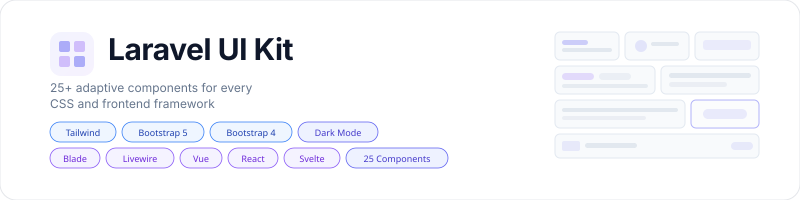

<p align="center">
    <picture>
        <source media="(prefers-color-scheme: dark)" srcset="art/banner-dark.svg">
        <source media="(prefers-color-scheme: light)" srcset="art/banner-light.svg">
        
    </picture>
</p>

<p align="center">
25 adaptive UI components that render natively in Tailwind, Bootstrap 5,<br>and Bootstrap 4 with Blade, Livewire, Vue, React, and Svelte support.
</p>

<p align="center">
    <a href="https://packagist.org/packages/jeremykenedy/laravel-ui-kit"></a>
    <a href="https://packagist.org/packages/jeremykenedy/laravel-ui-kit"></a>
    <a href="https://github.com/jeremykenedy/laravel-ui-kit/actions"></a>
    <a href="https://github.styleci.io/repos/1198564615?branch=main"></a>
    <a href="https://opensource.org/licenses/MIT"></a>
</p>

## Table of Contents

- [Framework Support](#framework-support)
- [Components](#components)
- [Features](#features)
- [Requirements](#requirements)
- [Installation](#installation)
- [Configuration](#configuration)
- [Quick Start](#quick-start)
- [Dark Mode](#dark-mode)
- [Icons](#icons)
- [Translations](#translations)
- [Accessibility](#accessibility)
- [Changing Frameworks](#changing-frameworks)
- [Artisan Commands](#artisan-commands)
- [Publishing Assets](#publishing-assets)
- [Testing](#testing)
- [Changelog](#changelog)
- [License](#license)

## Framework Support

Every component renders across all CSS and frontend combinations. Exactly one CSS framework and
one frontend are active at runtime, selected by config.

|  | Blade + Alpine.js | Livewire 3/4 | Vue 3 | React 18 | Svelte 4 |
|---|:---:|:---:|:---:|:---:|:---:|
| **Tailwind v4** | Yes | Yes | Yes | Yes | Yes |
| **Bootstrap 5** | Yes | Yes | Yes | Yes | Yes |
| **Bootstrap 4** | Yes | Yes | Yes | Yes | Yes |

## Components

| Component | Blade | Livewire | Vue | React | Svelte |
|---|:---:|:---:|:---:|:---:|:---:|
| Alert | `<x-ui::alert>` | `<livewire:ui-alert>` | `<UiAlert>` | `<UiAlert>` | `<UiAlert>` |
| Avatar | `<x-ui::avatar>` | `<livewire:ui-avatar>` | `<UiAvatar>` | `<UiAvatar>` | `<UiAvatar>` |
| Badge | `<x-ui::badge>` | `<livewire:ui-badge>` | `<UiBadge>` | `<UiBadge>` | `<UiBadge>` |
| Breadcrumbs | `<x-ui::breadcrumbs>` | - | - | - | - |
| Button | `<x-ui::button>` | `<livewire:ui-button>` | `<UiButton>` | `<UiButton>` | `<UiButton>` |
| Card | `<x-ui::card>` | `<livewire:ui-card>` | `<UiCard>` | `<UiCard>` | `<UiCard>` |
| Checkbox | `<x-ui::checkbox>` | `<livewire:ui-checkbox>` | `<UiCheckbox>` | `<UiCheckbox>` | `<UiCheckbox>` |
| Confirm | `<x-ui::confirm>` | `<livewire:ui-confirm>` | `<UiConfirm>` | `<UiConfirm>` | `<UiConfirm>` |
| Data Table | `<x-ui::data-table>` | `<livewire:ui-data-table>` | `<UiDataTable>` | `<UiDataTable>` | `<UiDataTable>` |
| Dropdown | `<x-ui::dropdown>` | `<livewire:ui-dropdown>` | `<UiDropdown>` | `<UiDropdown>` | `<UiDropdown>` |
| Form Group | `<x-ui::form-group>` | `<livewire:ui-form-group>` | `<UiFormGroup>` | `<UiFormGroup>` | `<UiFormGroup>` |
| Icon | `<x-ui::icon>` | `<livewire:ui-icon>` | `<UiIcon>` | `<UiIcon>` | `<UiIcon>` |
| Input | `<x-ui::input>` | `<livewire:ui-input>` | `<UiInput>` | `<UiInput>` | `<UiInput>` |
| Modal | `<x-ui::modal>` | `<livewire:ui-modal>` | `<UiModal>` | `<UiModal>` | `<UiModal>` |
| Nav | `<x-ui::nav>` | `<livewire:ui-nav>` | `<UiNav>` | `<UiNav>` | `<UiNav>` |
| Pagination | `<x-ui::pagination>` | `<livewire:ui-pagination>` | `<UiPagination>` | `<UiPagination>` | `<UiPagination>` |
| Password Input | `<x-ui::password-input>` | `<livewire:ui-password-input>` | `<UiPasswordInput>` | `<UiPasswordInput>` | `<UiPasswordInput>` |
| Search Input | `<x-ui::search-input>` | `<livewire:ui-search-input>` | `<UiSearchInput>` | `<UiSearchInput>` | `<UiSearchInput>` |
| Select | `<x-ui::select>` | `<livewire:ui-select>` | `<UiSelect>` | `<UiSelect>` | `<UiSelect>` |
| Stat Card | `<x-ui::stat-card>` | `<livewire:ui-stat-card>` | `<UiStatCard>` | `<UiStatCard>` | `<UiStatCard>` |
| Status Panel | `<x-ui::status-panel>` | `<livewire:ui-status-panel>` | `<UiStatusPanel>` | `<UiStatusPanel>` | `<UiStatusPanel>` |
| Tabs | `<x-ui::tabs>` | `<livewire:ui-tabs>` | `<UiTabs>` | `<UiTabs>` | `<UiTabs>` |
| Textarea | `<x-ui::textarea>` | `<livewire:ui-textarea>` | `<UiTextarea>` | `<UiTextarea>` | `<UiTextarea>` |
| Theme Toggle | `<x-ui::theme-toggle>` | `<livewire:ui-theme-toggle>` | `<UiThemeToggle>` | `<UiThemeToggle>` | `<UiThemeToggle>` |
| Toggle | `<x-ui::toggle>` | `<livewire:ui-toggle>` | `<UiToggle>` | `<UiToggle>` | `<UiToggle>` |

## Features

- 25 components that render natively in Tailwind v4, Bootstrap 5 and Bootstrap 4
- Five frontends: Blade with Alpine.js, Livewire, Vue 3, React 18 and Svelte 4
- Switching frameworks is a config change, not a code change
- Class based dark mode with a theme toggle that persists the choice
- 46 inline icons that render identically in every CSS framework
- Translations in 42 locales, following the application locale
- ARIA wiring, `focus-visible` rings and reduced motion support built in
- Interactive install, update and switch commands that also run fully from flags

## Requirements

- PHP 8.2, 8.3, 8.4 or 8.5
- Laravel 12 or 13 (tested in CI). Laravel 10 and 11 remain in the constraint so existing
  applications can keep installing, but they are no longer covered by CI: Composer blocks every
  Laravel 10 and 11 release by default because of published security advisories.
- One of: Tailwind v4, Bootstrap 5, Bootstrap 4
- One of: Alpine.js (Blade), Livewire 3 or 4, Vue 3, React 18, Svelte 4

Livewire is optional. The Livewire wrappers register only when Livewire is installed.

## Installation

```bash
composer require jeremykenedy/laravel-ui-kit
php artisan ui-kit:install
```

The install command asks which CSS and frontend framework to use, publishes the config, and
writes `UI_KIT_CSS` and `UI_KIT_FRONTEND` to your `.env`. Pass both options to skip the prompts:

```bash
php artisan ui-kit:install --css=bootstrap5 --frontend=livewire
```

## Configuration

```bash
php artisan vendor:publish --tag=ui-kit-config
```

```env
UI_KIT_CSS=tailwind             # tailwind, bootstrap5, bootstrap4
UI_KIT_FRONTEND=blade           # blade, livewire, vue, react, svelte
UI_KIT_PREFIX=ui                # component prefix: <x-ui::button>
UI_KIT_ICONS=lucide             # lucide, heroicons, fontawesome
UI_KIT_DARK_MODE=true
UI_KIT_DARK_MODE_DEFAULT=system # system, light, dark
UI_KIT_BREADCRUMBS_HOME=/home   # target of the leading breadcrumb
```

| Option | Env | Values | Default |
|--------|-----|--------|---------|
| `css_framework` | `UI_KIT_CSS` | `tailwind`, `bootstrap5`, `bootstrap4` | `tailwind` |
| `frontend` | `UI_KIT_FRONTEND` | `blade`, `livewire`, `vue`, `react`, `svelte` | `blade` |
| `prefix` | `UI_KIT_PREFIX` | any tag prefix | `ui` |
| `icons` | `UI_KIT_ICONS` | `lucide`, `heroicons`, `fontawesome` | `lucide` |
| `dark_mode.enabled` | `UI_KIT_DARK_MODE` | `true`, `false` | `true` |
| `dark_mode.default` | `UI_KIT_DARK_MODE_DEFAULT` | `system`, `light`, `dark` | `system` |
| `dark_mode.storage_key` | `UI_KIT_DARK_MODE_STORAGE_KEY` | localStorage key | `theme` |
| `dark_mode.persist_route` | `UI_KIT_DARK_MODE_ROUTE` | route name | none |
| `dark_mode.persist_url` | `UI_KIT_DARK_MODE_URL` | URL | none |
| `breadcrumbs.home_url` | `UI_KIT_BREADCRUMBS_HOME` | path | `/home` |
| `confirm.modal_id` | - | DOM id of the confirm dialog | `confirmModal` |
| `password.min_length` | - | integer | `8` |
| `datatable.per_page` | - | integer | `25` |

An unknown `UI_KIT_CSS` value falls back to Tailwind rather than failing to render. A custom
`UI_KIT_PREFIX` is registered in addition to `ui`, so `<x-ui::button>` keeps working either way.

## Quick Start

### Blade Components

```blade
<x-ui::card title="Dashboard">
    <x-ui::stat-card label="Users" value="1,234" icon="users" />
    <x-ui::button variant="primary">Save</x-ui::button>
    <x-ui::alert variant="success" dismissible>Settings saved.</x-ui::alert>
</x-ui::card>

<x-ui::input name="email" label="Email" type="email" required />
<x-ui::select name="role" label="Role" :options="$roles" />
<x-ui::toggle name="active" label="Active" />
```

### Modals

A modal listens for a window event named after its id. The element that opens it needs an Alpine
scope, which is what `x-data` provides:

```blade
<div x-data>
    <x-ui::button x-on:click="$dispatch('open-modal-edit-user')">Edit</x-ui::button>
</div>

<x-ui::modal id="edit-user" title="Edit user">
    <p>Body content.</p>

    <x-slot:footer>
        <x-ui::button variant="secondary" x-on:click="$dispatch('close-modal-edit-user')">Cancel</x-ui::button>
        <x-ui::button variant="primary">Save</x-ui::button>
    </x-slot:footer>
</x-ui::modal>
```

### Confirmations

Place one `<x-ui::confirm />` in your layout. Any button with a `confirm` attribute opens it:

```blade
<x-ui::button variant="danger" confirm="This cannot be undone." confirm-title="Delete user?" confirm-action="delete-user-form">
    Delete
</x-ui::button>

<x-ui::confirm />
```

`confirm-action` is the id of the form to submit when the dialog is accepted. When it does not
name a form, a `confirmed` event is dispatched instead.

### Livewire Components

The Livewire wrappers mirror the Blade components and delegate to them, so they follow the active
CSS framework. Livewire has no slots, so content is passed as a property:

```blade
<livewire:ui-alert variant="success" content="Settings saved." />
<livewire:ui-data-table :headers="['name', 'email']" :rows="$users" />
<livewire:ui-theme-toggle />
<livewire:ui-confirm />
```

### Vue / React / Svelte

```bash
php artisan vendor:publish --tag=ui-kit-js
```

Vue:

```vue
<script setup>
import UiButton from '@/ui-kit/vue/UiButton.vue'
import UiCard from '@/ui-kit/vue/UiCard.vue'
</script>

<template>
    <UiCard title="Profile">
        <UiButton variant="primary" @click="save">Save</UiButton>
    </UiCard>
</template>
```

React:

```jsx
import UiButton from '@/ui-kit/react/UiButton.jsx'
import UiCard from '@/ui-kit/react/UiCard.jsx'

export default function Profile({ save }) {
    return (
        <UiCard title="Profile">
            <UiButton variant="primary" onClick={save}>Save</UiButton>
        </UiCard>
    )
}
```

Svelte:

```svelte
<script>
  import UiButton from '@/ui-kit/svelte/UiButton.svelte'
  import UiCard from '@/ui-kit/svelte/UiCard.svelte'

  export let save
</script>

<UiCard title="Profile">
  <UiButton variant="primary" on:click={save}>Save</UiButton>
</UiCard>
```

## Dark Mode

Dark mode is class based. The theme toggle writes the chosen mode to `localStorage` and adds or
removes the `dark` class on `<html>`, so it works without a round trip to the server.

To also persist the choice for signed in users, point the toggle at an endpoint of your own:

```env
UI_KIT_DARK_MODE_ROUTE=profile.dark-mode
```

The endpoint receives `{"dark_mode": "light|dark|system"}`. When neither
`UI_KIT_DARK_MODE_ROUTE` nor `UI_KIT_DARK_MODE_URL` resolves, the toggle stays entirely client
side. A route name that is not registered is ignored rather than throwing.

## Icons

The icon component ships 46 inline outline icons and renders the same geometry in all three CSS
frameworks:

```blade
<x-ui::icon name="users" size="lg" />
<x-ui::button icon="trash" variant="danger">Delete</x-ui::button>
```

Set `UI_KIT_ICONS=fontawesome` to render `<i class="fa fa-{name}">` instead of inline SVG. An
unknown icon name renders a neutral placeholder rather than failing.

## Translations

Strings such as Previous, Next, Dismiss and Close come from the package translations, which ship
in 42 locales and follow the application locale. Override them by publishing:

```bash
php artisan vendor:publish --tag=ui-kit-lang
```

```blade
{{ __('ui-kit::ui-kit.pagination.next') }}
```

## Accessibility

Components ship the ARIA wiring you would otherwise have to add yourself: `aria-invalid` and
`aria-describedby` on fields with errors or hints, `aria-expanded` and `aria-haspopup` on
dropdowns, `role="dialog"` with `aria-modal` and a labelled title on modals, `role="switch"` on
toggles, `aria-current="page"` on the active breadcrumb and pagination link, `aria-sort` on
sortable columns, and `aria-hidden` on decorative icons. Focus rings use `focus-visible` so they
appear for keyboard users without showing on mouse clicks, and transitions are disabled under
`prefers-reduced-motion`.

## Changing Frameworks

After installation, use **update** or **switch** to change frameworks without losing configuration.

### Update (Interactive)

```bash
php artisan ui-kit:update
```

Or pass options directly:

```bash
php artisan ui-kit:update --css=bootstrap5 --frontend=vue
```

| Option | Values | Description |
|--------|--------|-------------|
| `--css` | `tailwind`, `bootstrap5`, `bootstrap4` | Change CSS framework |
| `--frontend` | `blade`, `livewire`, `vue`, `react`, `svelte` | Change frontend framework |

### Switch (Quick)

```bash
php artisan ui-kit:switch --css=bootstrap5
php artisan ui-kit:switch --frontend=livewire
php artisan ui-kit:switch --css=tailwind --frontend=vue
```

To switch every package that follows this convention:

```bash
php artisan ui:switch --css=bootstrap5 --frontend=vue
```

After switching, run `npm run build`.

## Artisan Commands

| Command | Description |
|---------|-------------|
| `ui-kit:install` | Fresh install with interactive prompts. Detects an existing installation. |
| `ui-kit:update` | Update framework selection interactively. Does not overwrite config. |
| `ui-kit:switch` | Quick framework switch via flags. |
| `ui:switch` | Switch CSS and frontend globally for all packages. |

### Install Options

| Flag | Description |
|------|-------------|
| `--css=` | CSS framework: `tailwind`, `bootstrap5`, `bootstrap4` |
| `--frontend=` | Frontend: `blade`, `livewire`, `vue`, `react`, `svelte` |
| `--force` | Skip the reinstall confirmation when already installed |

## Publishing Assets

| Tag | Publishes to |
|-----|--------------|
| `ui-kit-config` | `config/ui-kit.php` |
| `ui-kit-views` | `resources/views/vendor/ui-kit` |
| `ui-kit-lang` | `lang/vendor/ui-kit` |
| `ui-kit-js` | `resources/js/ui-kit` |
| `ui-kit` | All of the above |

## Testing

```bash
composer test
composer lint:test
```

Or directly:

```bash
./vendor/bin/pest --ci
./vendor/bin/pint --test
```

## Changelog

See [CHANGELOG.md](CHANGELOG.md).

## License

This package is open-sourced software licensed under the [MIT license](LICENSE).
